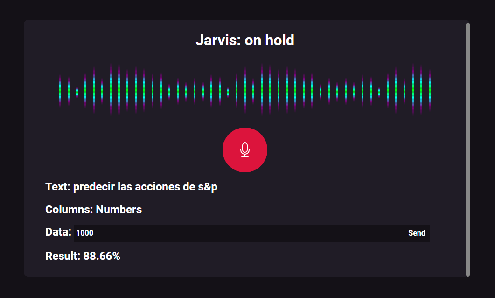

# JarvisTEC - FrontEnd

JarvisTEC - BackEnd [aquí](https://github.com/SebastianRV26/JarvisTEC-BackEnd)

## UI

### Login:

Utilizando Microsoft Azure:


### Asistente de voz:

Utilizando Speach to Text:



## Datos de prueba

```txt
1. Predecir la tarifa de viajes en bicicleta: 
distance=0.7,driver.AF8.tip=1.83

2. Predecir el precio de un carro: 
Selling_Price=3.35,Year=2014

3. Predecir el precio de un aguacate: 
4400.25,1358.53,1735.98,0.0,1305.74,130.0,1175.74,0.0,0,2015

4. Predecir la temperatura mínima del clima: 
MaxTemp=34,Temp9am=27

5. Predecir el seguro que debe pagar un empleador: 
bmi=19

6. Clasificar si un cliente se va a pasar de compañía telefónica: 
1,68.65,68.65,0

7. Clasificar un vino: 
8.8,0.34,0.33,9.7,0.036,46.0,172.0,0.9966,3.08,0.4,10.2,1

8. Predecir la cantidad de inventario
de la compañía: 
4,19,2017,7,14,28,28,4,4,195,3

9. Predecir el precio de las acciones
del mercado SP 500stock: 
1000000

10. Predicir la masa corporal: 
1.0708,93.1,85.2

11. Clasificar tipo de hepatits: 
1,23,47.0,19.1,38.9,164.2,17.0,7.09,3.20,79.3,90.4,70.1

12. Clasificar si una persona tiene un derrame: 
1,67.0,0,1,1,2,1,228.69,36.6,1
```

## Cómo ejecutarlo

Ejecutar los siguientes comandos:
```
npm install
npm start
```
Nota: Para probarlo es necesario correr el [backend](https://github.com/SebastianRV26/JarvisTEC-BackEnd) creado con Django.

## Integrantes:
* [Ali Hashemi Shirkavand](https://github.com/AliHashemiS)
* [Francisco Soto Quesada](https://github.com/franrsq)
* [Jairo Pacheco Campos](https://github.com/JairoPacheco)
* [Sebastián Rojas Vargas](https://github.com/SebastianRV26)

Curso: Inteligencia Artificial.
I Semestre 2022.
Profesor: Efrén Jimenez.